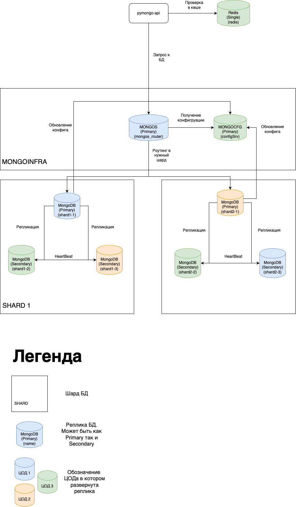

# Модуль 2. Шардирование и репликация

## Задание 1. Планирование

[Ссылка на схему](https://drive.google.com/file/d/1jHPhlwLspF6jt_S2BrUmCjku101KlSXU/view?usp=sharing)

[Ссылка на файл](assets/task1.drawio)



## Задание 2. Шардирование

### **Запуск**

1) Перейти в директорую mongo-sharding
```sh
cd mongo-sharding
```
2) Запустить `docker compose`
```sh
 docker compose up -d
```

3) Иницировать БД
```sh
./mongo-sharding.sh
```

4) Проверить количество документов 

```sh
 docker exec -it shard1 mongosh --port 27018
 > use somedb;
 > db.helloDoc.countDocuments();
 > exit();
```

```sh
docker exec -it shard2 mongosh --port 27019
 > use somedb;
 > db.helloDoc.countDocuments();
 > exit();
```

## Задание 3. Репликация

### **Запуск**

1) Перейти в директорую mongo-sharding-repl
```sh
cd mongo-sharding-repl
```
2) Запустить `docker compose`
```sh
 docker compose up -d
```

3) Иницировать БД
```sh
./mongo-sharding-repl.sh
```

## Задание 4. Кэширование

### **Запуск**

1) Перейти в директорую sharding-repl-cache
```sh
cd sharding-repl-cache
```
2) Запустить `docker compose`
```sh
 docker compose up -d
```

3) Иницировать БД
```sh
./sharding-repl-cache.sh
```

## Задание 5. Service Discovery и балансировка с API Gateway

## Задание 6. CDN
